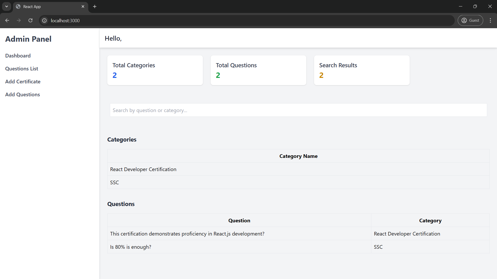

# 🌟 Certification Management System

A comprehensive solution for managing certifications, built using **Node.js**, **React**, and **MongoDB**. This project is structured into a `frontend` and `backend` to ensure scalability and maintainability.

---

## 🚀 Features
- **🎨 Frontend**: React.js-based responsive interface for seamless user interactions.
- **⚙️Backend**: Node.js API with MongoDB integration for secure and efficient data management.
- **Database**: MongoDB Atlas for cloud-hosted, scalable storage.
- **Styling**: Tailwind CSS for modern and flexible UI components.
- **Environment Configuration**: Manage URLs and sensitive data securely using .env files.

---

# Screenshots

## Homepage(Dashboard)


## Add Certification


## Add Questions


## Add Questions List


## Add DatabaseTable 1:


## Add DatabaseTable 2:


## 🛠 Prerequisites
Before running the project, ensure you have the following installed:
- **Node.js** (v14+)
- **MongoDB** (local or Atlas instance)
- **npm** 

---

## 📥 Installation

### Clone the Repository
```bash
git clone git@github.com:JigarHingu/certification.git
cd certification
```

## Install Dependencies

### For frontend
```bash
cd frontend
npm install
```

### For Backend
```bash
cd backend
npm install
```

## Configuration

### Backend

1. Create a .env file in the backend directory:
```bash
PORT=5000
MONGO_URI=mongodb+srv://<username>:<password>@cluster0.mongodb.net/<dbname>
```

2. Replace <username>, <password>, and <dbname> with your MongoDB credentials.

## Frontend

### If needed, configure environment variables in the frontend directory:

1. Create a .env file in the frontend directory:
```bash
REACT_APP_API_URL=http://localhost:5000/api
```

## Running the Project

### Backend

1. Navigate to the backend directory:
```bash
cd backend
```

2. Start the backend server:
```bash
node server.js
```

### Frontend

1. Navigate to the frontend directory:
```bash
cd frontend
```

2. Start the frontend server:
```bash
npm start
```

The frontend will run on http://localhost:3000, and the backend will run on http://localhost:5000.

# 🤝 Contributing

- We welcome contributions!